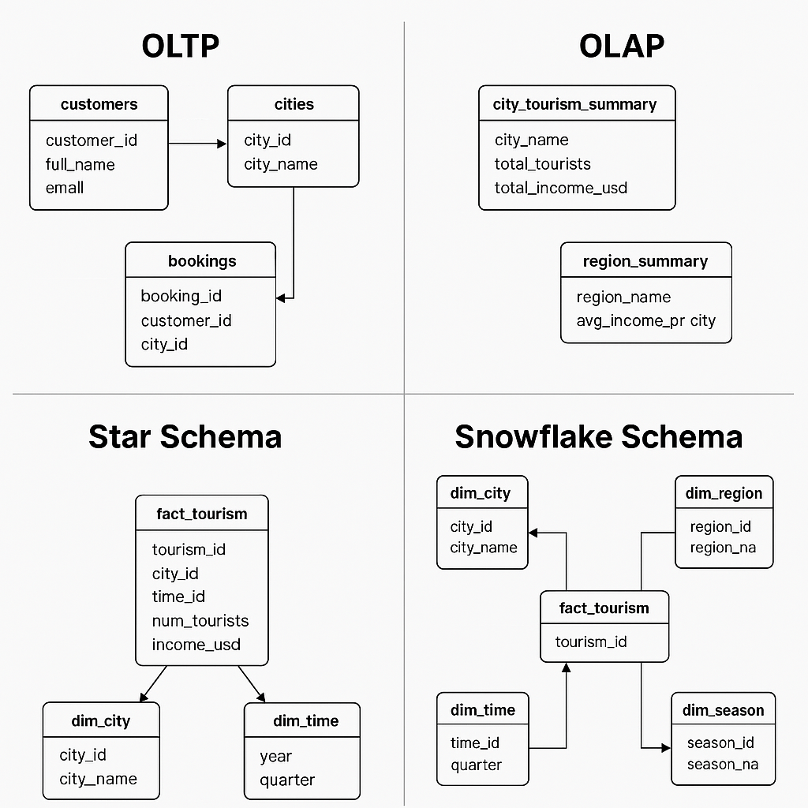

# Tourism Data Schemas – OLTP vs OLAP | Star vs Snowflake

> 🧑‍💼 **For non-technical readers:** see [Project Motivation](#project-motivation) and [Key Takeaways](#key-takeaways)  
> 🧑‍💻 **For technical readers:** skip to [Technical Overview](#technical-overview)

---

## 📌 Project Motivation

I built this project to explore OLTP/OLAP systems and dimensional modeling concepts by applying them to a practical use case.      

Instead of just reading about OLTP/OLAP and dimensional modeling, I decided to apply what I learned using simple SQL structures based on city-level tourism data in Turkey.

**Goals:**
- Understand how real-life business processes are modeled
- Practice designing Star and Snowflake schemas
- Showcase my learning with a clean and focused GitHub project

---

## 🎯 Key Takeaways

- OLTP and OLAP are two core database usage patterns in real systems
- Kimball’s modeling method helps design scalable and readable data warehouses
- Schema design affects performance, readability, and flexibility

---

## 🧠 Technical Overview

This repository contains four different SQL schema examples:

| Schema | Purpose | Description |
|--------|---------|-------------|
| `oltp_example.sql` | OLTP | Normalized tables for booking transactions |
| `olap_example.sql` | OLAP | Aggregated summary tables for reporting |
| `star_schema.sql` | OLAP | Denormalized star schema with dimensions |
| `snowflake_schema.sql` | OLAP | Normalized snowflake schema with sub-dimensions |

---

## 🖼 Schema Comparison Diagram

**Schema Diagram v2 - more accurate:**

---

## 🔍 OLTP vs OLAP

| Feature         | OLTP                                 | OLAP                              |
|-----------------|--------------------------------------|------------------------------------|
| Purpose         | Transactional processing             | Analytical processing              |
| Data Structure  | Highly normalized                    | Denormalized or semi-normalized    |
| Operations      | Insert, Update, Delete               | Read, Aggregate, Analyze           |
| Example         | Bookings, Payments                   | Yearly Sales, Customer Insights    |

---

## 🌟 Star vs Snowflake Schema

**Star Schema**
- Denormalized
- Fewer joins, faster queries
- Ideal for BI tools and dashboards

**Snowflake Schema**
- Normalized
- More joins, better data integrity
- Useful when you need detailed breakdowns

---

## 🧩 Kimball's 4-Step Dimensional Modeling Process

1. **Choose the Business Process**  
   _Tourism activity in cities across Turkey._

2. **Declare the Grain**  
   _Each record represents statistics for a city in a specific year._

3. **Identify Dimensions**  
   _City, Time (Year/Quarter/Season), Region, etc._

4. **Identify Facts**  
   _Tourist count, tourism income, duration, etc._

---

## 🏗 Domain Example: Turkey

The sample tables use city and region names from Turkey.  
All tables are focused on structure and do not require populated data to understand the logic.

---

## 🚀 Getting Started

Run any `.sql` file in your preferred SQL engine (PostgreSQL, MySQL, etc.)  
No additional data or tools are required.

---

## 📬 Feedback

This is a small part of a bigger learning journey toward data engineering.  
If you have feedback or suggestions, feel free to connect on [LinkedIn](https://www.linkedin.com/in/safacanmetin) or open an issue!
